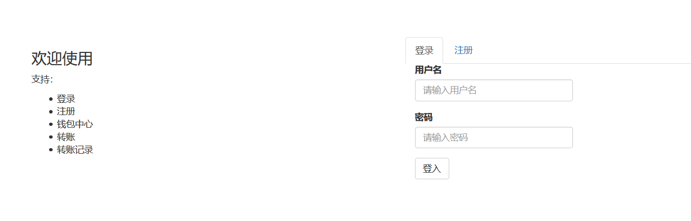
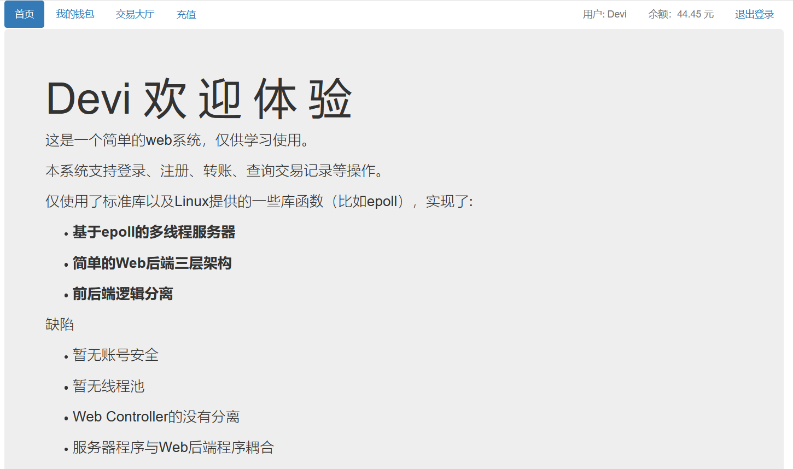
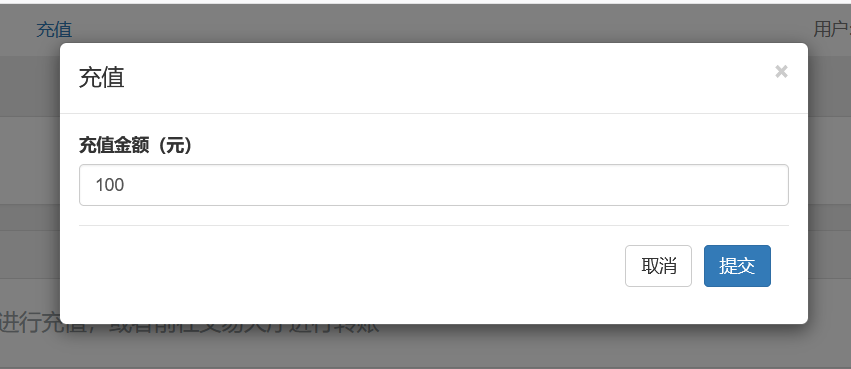
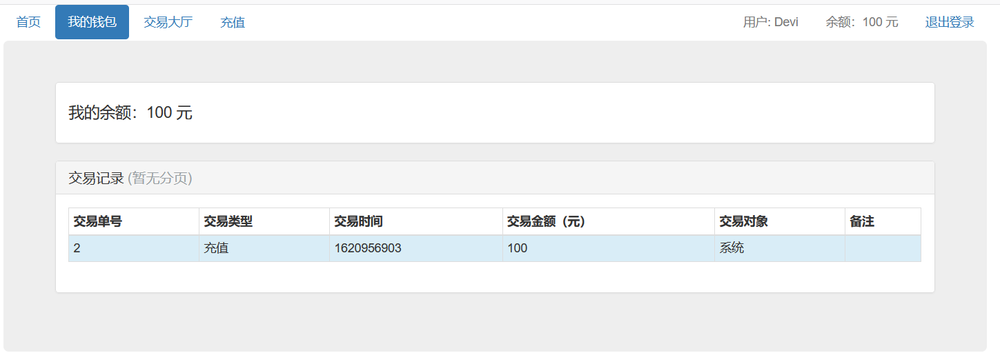
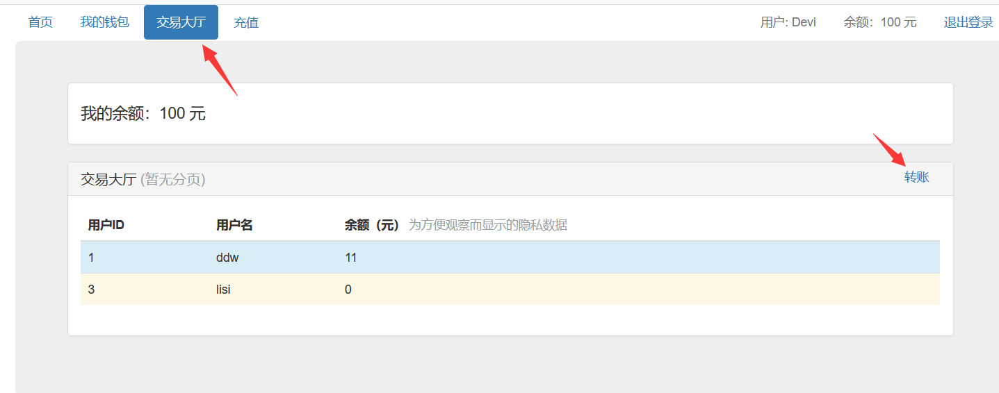
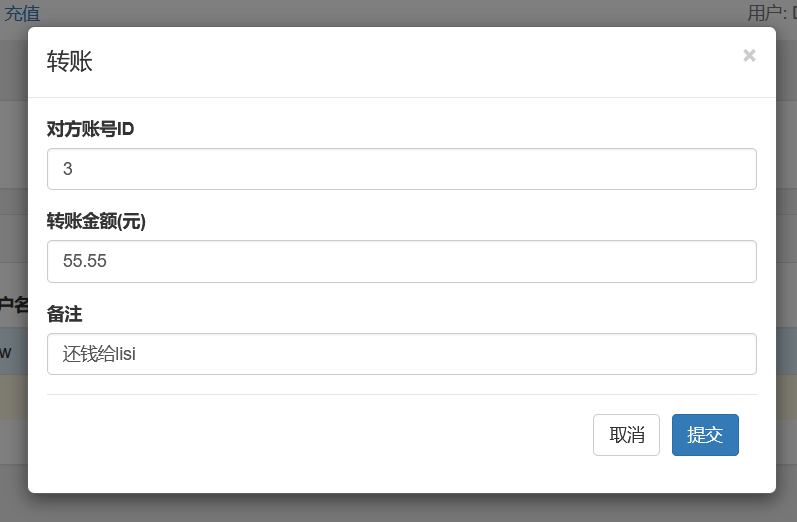
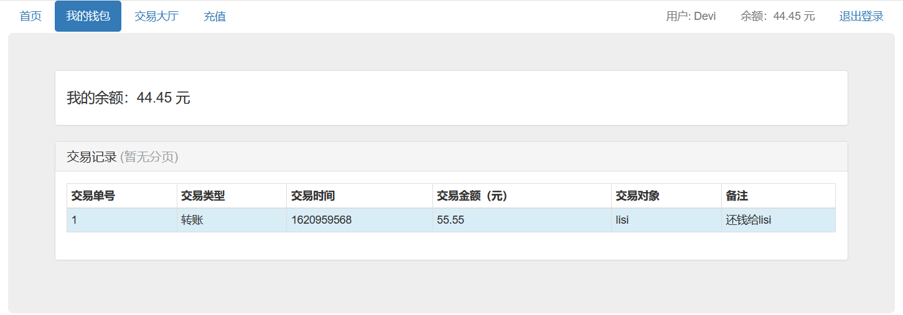
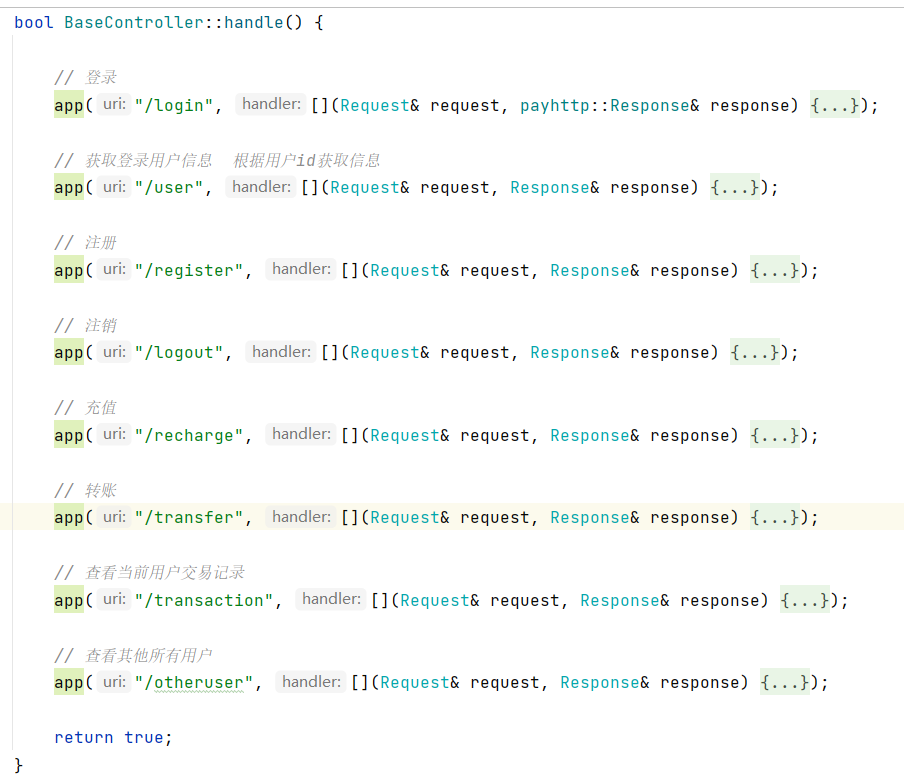

# 1. 项目介绍

本项目C++为初学者的学习项目，从epoll到HTTP服务器到Web项目，除了用了boost的字符串处理，全部手撸，没有任何其他依赖。 实现了用户的注册、登录、充值、交易（转账）功能。

epoll服务器部分参考《Linux系统编程》以及boost的axio的example（尤其是HTTP协议解析部分）。

web后台是笔者按照已有的web后台开发经验所写，笔者比较熟悉Java后端开发，本想尝试使用反射机制实现一套MVC框架。

web前端使用bootstrap可视化编程做的，jq写的比较烂。

数据库采用的是linux文件系统，仅仅做了简单的文件加载以及保存。

本项目的主要目的为技术学习，最好是有大佬给出建议和指正。

# 2. 项目演示

1. 运行参数（笔者使用Clion远程开发）

   
   

2. index页面

   

第一次使用，进行注册，注册完毕后会记录登录状态。

3. 注册后home页面

我们可以先进行充值，然后查看钱包

4. 充值

   

4. 我的钱包

   

5. 测试转账功能（需要先注册另外一个账号，保证存在转账对象）

   

# 3. 快速开始

参考环境

- C++ 11
- Cmake 3.19
- Ubuntu 16.04.7 LTS (GNU/Linux 4.15.0-136-generic x86_64)
- Clion 2021.1

直接使用Cmake编译运行即可（笔者Cmake还没有系统学过，用的大概是最搓的手法）

运行参数： 项目地址 端口 前端文件夹地址 数据库文件夹地址 address port doc_root database_root

如： 172.x.X.22 8787 /home/b6/payhttp/resources/htmls /home/b6/payhttp/resources/database

# 4. 项目结构

├── CMakeLists.txt

├── main.cpp

├── readme.md

├── readme-img

├── resources -- **静态资源**

│-------- ├── database -- **数据文件**

│-------- └── htmls -- **前端文件**

├── server -- **服务器代码**

│-------- ├── include

│-------- │-------- ├── Constant.hpp -- **一些常量**

│-------- │-------- ├── EpollConnection.hpp -- **客户端连接**

│-------- │-------- ├── EpollConnectionManager.hpp -- **连接管理器**

│-------- │-------- ├── EpollServer.hpp -- **服务入口**

│-------- │-------- ├── Header.hpp -- **HTTP请求头kv对** （可换成map）

│-------- │-------- ├── RequestHandler.hpp -- **HTTP请求头预处理器**

│-------- │-------- ├── Request.hpp -- **HTTP请求头**

│-------- │-------- ├── RequestParser.hpp -- **HTTP请求头信息解析器**（状态机）

│-------- │-------- └── Response.hpp -- **HTTP响应头**

│-------- └── src -- 对应源码

└── web -- **Web后台代码**

│-------- ├── core -- **运行所需的一些非业务核心类**

│-------- │-------- ├── GlobalAutoIds.cpp -- **主键生成器**

│-------- │-------- ├── GlobalAutoIds.hpp

│-------- │-------- ├── Json.cpp -- **蹩脚的Json解析器**

│-------- │-------- ├── Json.hpp

│-------- │-------- └── RCode.hpp -- **响应体的状态信息**

│-------- └── src -- **Web三层架构代码** 

│-------- │-------- ├── controller -- **控制层**

│-------- │-------- └── service -- **业务层**

│-------- │-------- ├── dao -- **持久层**

│-------- │-------- ├── model -- **数据模型**

# 5. epoll服务器

## 5.1 基本逻辑

别名：

sfd：服务器socket fd

cfd：客户端socket fd

---

采用epoll_wait阻塞+ET模式+cfd非阻塞形式。

在while循环中进行epoll_wait，只监听读事件；

对于sfd事件，执行doAccept；

对于cfd事件，另开线程执行doRead，在doRead中完成本次请求的解析以及响应。

## 5.2 并发处理

1. accept之后对于每个cfd，另开一个线程处理，并detach
2. Request、Response是线程变量，没有并发问题
3. 所有业务逻辑类均无状态，使用static修饰（单例也可以，但是由于本系统没有复杂的继承体系，每个业务类都没有状态信息，因此直接使用静态方法）

> 线程池后续完善

# 6. web后端
## 6.1 三层架构原理

笔者比较熟悉Java，对于c++的web开发不是很了解，网上的文字资料似乎比较少。

开源代码虽然有，但是体量太大，短时间研究时间投入太大，因此笔者直接使用Java的思想写了一个。

一开始想用反射，然而c++本身不支持反射，自己再手撸一个反射有点难，于是做了一个比较笨拙的实现。

在Java中（以Tomcat为例），需要开发者使用注解或者是xml文件配置控制器与uri的映射关系，本质上都是“写死的代码”，
xml配置只是方便了开发者，而注解配置看似动态，其实只是还是配死的。
因此其实只需要模拟这个配置过程即可。

---

controller目录下只有一个控制器BaseController（笔者暂时没做到控制器分离，后续描述原因）。

该控制器持有一个<uri,Handler> 的map容器，Handler是一个函数指针，表示处理对应的uri。

系统启动时，会执行注册方法，将BaseController下的所有<uri,Handler>加到map容器中，然后在服务器处理程序中通过uri获取到
对应的Handler函数指针，进行执行。

> 此处Web后端代码与服务器代码耦合，服务器代码需要使用Web后端提供的一个容器。（更像是依赖不符合常理，服务器程序依赖了上层逻辑）。

> 解决思路：<url,Handler>容器服务端代码持有，让Web后端实现进行注册。（一开始没设计好）

## 6.2 为什么没有分离控制器

> 由于笔者本身技术水平有限，下面描述一下当初设计与实现的时候，为什么没能分离控制器。

可以看到，控制器只有一个BaseController，所有的处理都在一个方法里面，实际情况应该是UserController、TransactionController......

一般情况下，一个model类对应一个Controller。

之所以只有一个，是因为需要提供一个控制器方法的“扫描器”。（扫描器只是一个描述，表示能够让服务器代码感知到url与controller的对应关系。）

当前的扫描器就是一个map容器，而这个map容器被BaseController持有也好，被EpollServer持有也好，最终都需要**控制器本身将自己注册进去**。

Java的扫描器基于反射，比如说注解形式，服务器程序会在运行时扫描对应的注解，然后建立一个<url,controller>的容器。
由于注解的存在（或者说反射机制），无论你的控制器散落在哪，都能被扫描然后注册到对应容器中。

---

但是c++本身没有容器，现在考虑以下情况：

假如现在有两个控制器，UserController、TransactionController，
然后他们各自拥有5个<uri,handler>的方法，此时需要将这10个方法在运行时让EpollServer感知到。

1. Web后端主动注册：假设EpollServer持有一个<uri,controllerHandler>的容器，需要Web后端将对应的控制器方法注册进去。
   但是怎么注册进去？让控制器自己注册自己，这个我试了下，好像实现不了。提供一个专门的扫描器，运行时扫描所有控制器，然后拿到控制器的
   函数指针，如何运行时拿到某个类的函数指针？（Java通过反射实现），不太好解决。

2. EpollServer主动扫描：服务器提供一个**虚函数VirtualController**让Web后端实现，也就是这10个控制器方法，
   然后运行时EpollServer通过Controller虚函数进行调用。但是这就要求EpollServer能够拿到VirtualController的子类指针，即：需要Web后端将
   自己实现的VirtualController指针注册到EpollServer的某个容器中，这就绕回了刚开始的难点：如何扫描所有VirtualController的子类？
   
   
所以最终选择了这么个笨拙的方法，只有一个控制器类，免除了扫描困扰。

# 7. web前端

前端渣渣，用的 [bootstrap可视化](https://www.runoob.com/try/bootstrap/layoutit/#) 写的页面。

核心代码就是那些ajax请求，该部分比较简单。

# 8. 其他功能补充
- 登录状态使用的cookie保持的，没有做session方面的处理；
- main.cpp中有个init方法，该方法会读取数据文件；
- EpollServer构造方法中注册了的退出信号，退出之后会保存数据文件，回收fd资源；
- EpollServer有个sumer_成员被注释掉了，该成员用于定时打印当前连接个数，有需要的话可以打开注释。

# 9. 未完成的功能

- Json解析器毫无扩展性可言，专类专用，建议自己实现一个或者换个第三方的。
- 线程池还没写
- Controller没有分离（暂无实现思路）
- 服务器程序与web后端耦合
- 存在中文导致的偶发bug
- 安全性的一些东西，比如账号安全，资金安全

> **重申，该项目只是笔者学习C++之后，为了熟悉C++语法所做的一个小项目，肯定有诸多不合理的地方，感谢大佬批评指正 ^_^**

